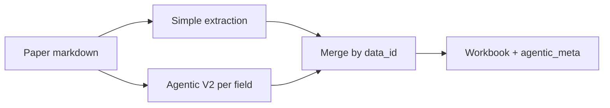

# Agentic extraction architecture

**Hybrid mode** runs two paths on the same paper: a **simple** pass fills every column, and **agentic** passes refine a few high-risk fields. The workbook only uses an agentic value when that field’s run ends in `pipeline_decision == accept`; otherwise the simple value stays. Details live in `extraction_pipeline.py` (merge) and `agentic_workflow.py` (V2).

**Default CLI:** `--agentic-version v2` (`run_hybrid_agentic_extraction.py`, `agentic_extract.py`). Use `--agentic-version v1` for the older `run_agentic_field_extraction` path.

---

## Hybrid (high level)

- **Simple:** one model call with `build_batch_input.py` prompts → JSON with all `BASE_FIELDS`.
- **Agentic:** for each configured field, the V2 pipeline below → one JSON blob for that field + `pipeline_decision`.

---

## V2 pipeline (one field, one paper)

Order matches `run_agentic_field_extraction_v2` in `agentic_workflow.py`.

1. **Prompt** — Load `FIELD_CONFIGS[field]` from `build_field_extractors.py` (system prompt, instructions, schema).
2. **First extract** — Model produces a draft. **Tools on or off** is set by `V2_FIELD_PROFILES` (simple fields: no tools; DV / MPCR: tools with capped rounds).
3. **Validate / repair** — `validate_field_output` (deterministic). If it fails, the **validation-repair** model runs **once** with tools, then you move on (not a loop-until-perfect).
4. **Recovery (tool-free fields only)** — If the profile is tool-free **and** (validation still fails **or** `needs_review_gate` is not `auto_accept`), run the extractor **again with tools**, then run step 3 again.
5. **Critic** — Skeptical audit with tools, up to `max_critic_rounds`.
6. **Revision** — Only if the critic asks for grounded fixes; then back to critic if more rounds remain.
7. **Validate / repair again** — Same pattern as step 3 after the critic/revision chain.
8. **Finalize** — `_finalize`: validation + `needs_review_gate`. **`accept`** only if validation is OK **and** the gate returns `auto_accept`. Otherwise **`abstain`** or **`needs_review`** — hybrid does **not** overwrite the simple value for that field.

---

## Merge rule (what you see in Excel)

| `pipeline_decision` | Effect on the sheet |
| --- | --- |
| `accept` | Agentic value merged for that field (for matching `data_id`). |
| `abstain` / `needs_review` | Simple extraction kept; see `agentic_meta` for `merge_applied`, gate output, traces. |

---

## Tools (`agentic_tools.py`)

All of these can be used during extractor, critic, revision, or validation-repair turns (within each step’s tool-round cap).

| Tool | Purpose |
| --- | --- |
| `quote_finder` | Locate relevant spans in the paper. |
| `evidence_pack_builder` | Compact snippet pack for a field. |
| `condition_aligner` | Match or split treatment / control rows. |
| `calculator` | Safe arithmetic. |
| `normalization_checker` | Check DV normalization / efficiency-style formulas. |
| `payoff_formula_parser` | Pull MPCR / payoff ingredients from text. |
| `field_rulebook` | Deterministic hints for the active field. |
| `validate_candidate_output` | Run the same validation as the pipeline on a draft. |
| `needs_review_gate` | `auto_accept` vs flag for human review. |

---

## Supported agentic fields

- `CONFIG_playerCount`
- `CONFIG_allOrNothing`
- `CONFIG_MPCR`
- `DV_contributionRate`
- `DV_efficiency`
