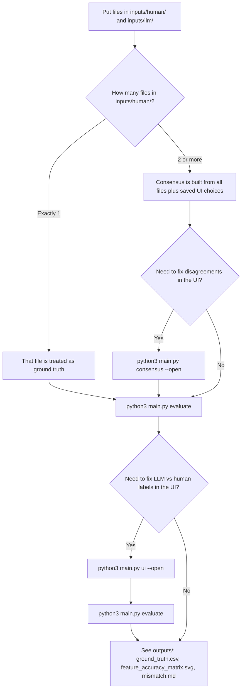

# Human vs LLM Data Extraction Comparison

Two-stage workflow: build **human ground truth** (one file or consensus across annotators), then **compare LLM extraction** to that ground truth and produce an evaluation matrix.

## Where to put your files

| What | Folder |
|------|--------|
| Human extraction(s) | `inputs/human/` — one or more `.csv` / `.xlsx` files |
| LLM extraction | `inputs/llm/` — typically `LLM_generated.csv` or `LLM_generated.xlsx` |

The newest file wins when both `.csv` and `.xlsx` exist for the same basename (`human_generated`, `LLM_generated`).

## Decision flow: what to run



## Quickstart (three steps)

1. **Install** (once):

   ```bash
   python3 -m venv .venv
   . .venv/bin/activate
   python -m pip install -r requirements.txt
   ```

2. **Drop data** into `inputs/human/` and `inputs/llm/`.

3. **Run evaluation** (rebuilds ground truth, matrix, and mismatch report):

   ```bash
   python3 main.py evaluate
   ```

   `evaluate` now defaults to **lab-only**. To run on the full benchmark set instead:

   ```bash
   python3 main.py evaluate --eval-scope all --reviewer YourName
   ```

After step 3, open **`outputs/`**:

- `ground_truth.csv` — materialized human ground truth  
- `feature_accuracy_matrix.svg` — per-feature accuracy image  
- `mismatch.md` — summary, field examples, and error taxonomy  

Optional: use **`python3 main.py consensus --open`** (multiple human files) or **`python3 main.py ui --open`** (Stage 2 review) before re-running **`evaluate`**.

## Primary CLI commands

| Command | Purpose |
|---------|---------|
| `python3 main.py evaluate` | Auto-detect single vs multiple human files; by default evaluate on the **lab-only** paper subset; write `outputs/ground_truth.csv`, matrix, `outputs/mismatch.md` |
| `python3 main.py refresh-eval` | Same pipeline as `evaluate` without the annotator-count banner (after you edit inputs) |
| `python3 main.py consensus --open` | Stage 1 UI + server: resolve disagreements when you have **2+** human files |
| `python3 main.py ui --open` | Stage 2 UI + server: override match/mismatch for LLM vs human cells |
| `python3 main.py feature-matrix` | Print matrix in the terminal (uses reviewed classifications) |

## How single vs multiple human files works

- **One file in `inputs/human/`**: the tool materializes it as `outputs/ground_truth.csv` (same internal pipeline as multi-annotator, with no cross-file disagreements). You can still use `data/consensus_events.csv` if you later add annotators.
- **Two or more files**: ground truth is built from alignment across annotators and any selections stored in `data/consensus_events.csv` (from the consensus UI).

## Other useful commands

```bash
python3 main.py ground-truth          # Rebuild only outputs/ground_truth.csv
python3 main.py build                 # Regenerate outputs/comparison.html
python3 main.py finalize --session default --reviewer alice
python3 main.py analyze               # Writes meta_*.csv under data/
python3 main.py clean                 # Dry-run list of removable artifacts; add --yes to delete
python3 main.py test                  # Unit tests
```

## Repository layout

```
inputs/
  human/          # Your human extraction file(s)
  llm/            # Your LLM extraction file

outputs/          # Generated (often gitignored): ground truth, matrix SVG, HTML UIs, mismatch.md

data/             # Persistent state: review_events, consensus_events, final_review_dataset__*.csv
```

Column map (human ↔ LLM) lives in **`utils/columns.py`**. Row alignment uses **`utils/row_alignment.py`** (smart matching, not raw index pairing).

## Requirements

- Python 3.10+
- Dependencies in `requirements.txt` (`fastapi`, `uvicorn`, `openpyxl`, …)
